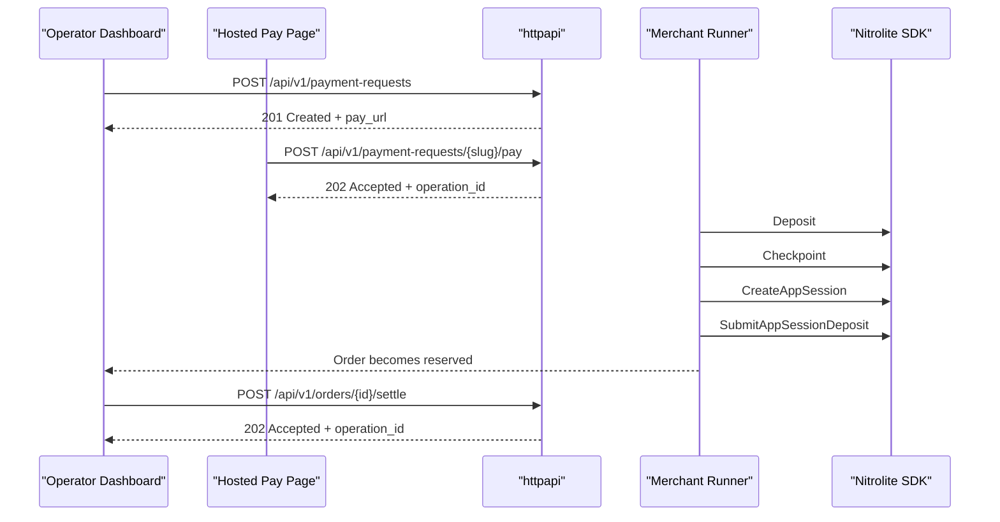

# Architecture

## Runtime shape

- `cmd/server` loads config, signer, Nitrolite manager, SQLite store, merchant runner, and the HTTP/web handler
- `internal/nitrolite.Manager` owns the active SDK client, health state, and reconnect loop
- `internal/store` owns SQLite persistence for merchant records and the operator lease
- `internal/service` owns raw SDK-backed services plus merchant orchestration and the async operation runner
- `internal/httpapi` is a thin transport layer with decode -> service -> encode plus auth/lease middleware
- `web/` is a no-build static UI embedded into the Go binary

## Product surfaces

- `/`
  - merchant operator dashboard
  - creates hosted pay links
  - shows orders, payouts, operations, and lease status
- `/pay/{slug}`
  - public sandbox customer payment page
  - simulates payment by queuing backend capture
- `/reference`
  - embedded RapiDoc explorer backed by `/openapi.json`
- `/advanced`
  - raw operator/debug console
  - JSON panels, raw mutations, session keys, destructive operations

The same server process powers all four surfaces.

## Trust model

- the backend demo signer is the only Nitrolite signer
- the browser never sees private key material
- hosted pay links do not use customer wallets
- reads stay public
- raw writes require write access
- merchant writes require write access plus active operator lease ownership

## Operator lease

The backend signer is shared, so merchant writes are serialized behind a singleton lease.

Lease rules:

- one active lease row in SQLite
- tied to the unlocked browser write-session cookie value
- 10 minute TTL
- 30 second dashboard heartbeat
- lease is cleared on server startup because write sessions are in-memory

Known v1 risk:

- background browser tabs can throttle timers
- an operator may lose the lease while the tab is backgrounded
- the next write must surface the conflict clearly and require reacquire

## Startup sequence

1. load config
2. initialize signer
3. initialize Nitrolite manager
4. initialize SQLite store
5. clear any persisted lease row
6. initialize merchant runner
7. start `manager.Run(ctx)`
8. start `runner.Run(ctx)`
9. start `http.Server`

## Merchant mutation runner

The merchant runner is a single in-process goroutine that serializes SDK writes.

Operation states:

- `queued`
- `running`
- `waiting_chain`
- `waiting_sync`
- `completed`
- `failed`

Exit rules:

- `waiting_chain`
  - polls chain receipt state on a backoff schedule
- `waiting_sync`
  - polls SDK read paths until channel/session state catches up

Restart behavior:

- resume `queued`, `waiting_chain`, `waiting_sync`
- mark `running` as failed with `interrupted by server restart`

## Merchant flow

## Dashboard reads

`GET /api/v1/dashboard/overview` merges:

- SDK state:
  - health
  - balances
  - channel summary
  - latest signed state
  - latest activity
- SQLite state:
  - payment requests
  - orders
  - payouts
  - operations
  - operator lease

If required SDK reads fail, the route returns `503`; the UI fetches `/healthz` separately so it can still render system status.
